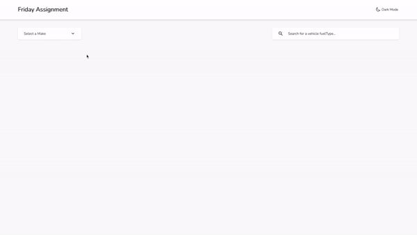

# Listing and Filtering the Car list - Friday Code Challenge

This is a list application and it is created to show coding skills to the Friday (company). The Client-side is developed using React.js.

Created the project using Typescript and Redux(Thunk). 

Wrote unit tests for the project components using Jest and Enzyme libraries.

Used the Tailwind, in order to, create responsive designs. I used Tailwind because it is really easy to use and it increases the readability of the codes.

Also added Webpack and Babel, in order to increase the appliction performance.

Added Eslint, and Prettier. Also, added Husky in order to prevent pushing badly formatted codes.


## Table of Contents
- [Project Overview](#projectoverview)
- [Installation](#installation)
- [Test](#test)
- [Structure](#structure)
- [Support](#support)
- [Contributing](#contributing)


### ProjectOverview

A short overview of the project



## Installation
### manually
```sh
git clone https://github.com/mJiyan/typescript-list-filter-cars
cd typescript-list-filter-cars/server
yarn
yarn start

cd typescript-list-filter-cars/client
yarn
yarn start
Open your browser at http://0.0.0.0:8080 
```


## Test
```sh
git clone https://github.com/mJiyan/typescript-list-filter-cars
cd typescript-list-filter-cars/server
yarn
yarn test

cd typescript-list-filter-cars/client
yarn
yarn test
```


## Structure
```
├─ client
│   ├─ __test__
│   │  ├─ setup
│   │  │  └─ setupTest.js
│   │  ├─ Components
│   │  └─ Mock
│   ├─ .huksy
│   │  ├─ pre-commit
│   │  └─ pre-push
│   ├─ public
│   │  └─ index.html
│   │
│   ├─ src
│   │  ├─ assets
│   │  │  └─ style
│   │  │     └─ tailwind.css
│   │  │
│   │  ├─ components
│   │  │  ├─ Card
│   │  │  │  └─ index.tsx
│   │  │  ├─ CardList
│   │  │  │  └─ index.tsx
│   │  │  ├─ Filter
│   │  │  │  └─ index.tsx
│   │  │  ├─ Header
│   │  │  │  └─ index.tsx
│   │  │  ├─ MakeList
│   │  │  │  └─ index.tsx
│   │  │  ├─ ModelList
│   │  │  │  └─ index.tsx
│   │  │  ├─ Search
│   │  │  │  └─ index.tsx
│   │  │  └─ index.tsx
│   │  │
│   │  ├─ models
│   │  │  ├─ Card
│   │  │  │  └─ index.tsx
│   │  │  ├─ CardList
│   │  │  │  └─ index.tsx
│   │  │  ├─ Countries
│   │  │  │  └─ index.tsx
│   │  │  ├─ Filter
│   │  │  │  └─ index.tsx
│   │  │  ├─ Routes
│   │  │  │  └─ index.tsx
│   │  │  ├─ Search
│   │  │  │  └─ index.tsx
│   │  │  └─ index.tsx
│   │  │
│   │  ├─ config
│   │  │  └─ routes.ts
│   │  │
│   │  ├─ redux
│   │  │  ├─ actions
│   │  │  │  ├─ Makes
│   │  │  │  │  ├─ index.ts
│   │  │  │  │  └─ types.ts
│   │  │  │  ├─ Models
│   │  │  │  │  ├─ index.ts
│   │  │  │  │  └─ types.ts
│   │  │  │  └─ Vehicles
│   │  │  │     ├─ index.ts
│   │  │  │     └─ types.ts
│   │  │  └─ reducers     
│   │  │     ├─ Makes
│   │  │     │   └─ index.ts
│   │  │     ├─ Models
│   │  │     │   └─ index.ts
│   │  │     ├─ Vehicles
│   │  │     │   └─ index.ts
│   │  │     └─ index.ts
│   │  │
│   │  ├─ services
│   │  │  ├─ api.ts
│   │  │  └─ constants.ts
│   │  │
│   │  ├─ views
│   │  │  ├─ Vehicles
│   │  │  │  └─ index.tsx
│   │  │  └─ index.tsx
│   │  │
│   │  ├─ react-app-env.d.ts
│   │  ├─ App.tsx
│   │  ├─ index.tsx
│   │  └─ Store.ts
│   │
│   ├─ .dockerignore
│   ├─ .eslintrc
│   ├─ .gitignore
│   ├─ .prettierrc
│   ├─ babel.config.js
│   ├─ jest.config.js
│   ├─ LICENSE
│   ├─ postcss.config.js
│   ├─ tailwind.config.js
│   ├─ tsconfig.json
│   ├─ package.json
│   └─ webpack.config.js
│
│
├─ apiserver
│   ├─ makes.json
│   ├─ models.json
│   ├─ server.js
│   └─ vehicles.json
│
├─ LICENSE
└─ README.md
```

## Support

Please [open an issue](https://github.com/mJiyan/typescript-list-filter-cars/issues) for support & suggestions.


## Contributing

Please contribute using [Github Flow](https://guides.github.com/introduction/flow/). Create a branch, add commits, and [open a pull request](https://github.com/mJiyan/typescript-list-filter-cars/compare).